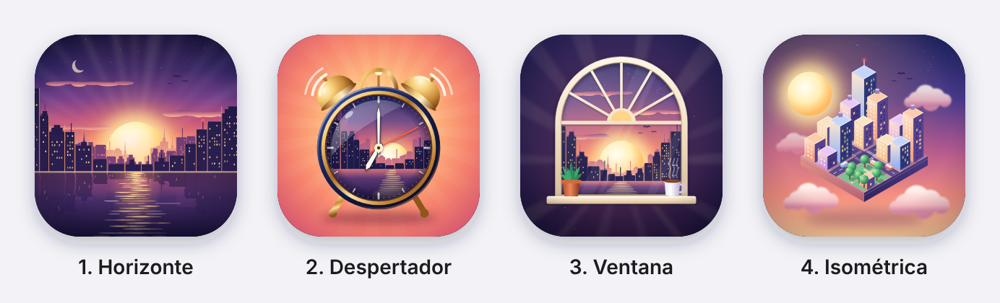

# Vigilia

Alarma para iPhone (iOS 26 o posterior) hecha con **AlarmKit**, el framework de alarmas que Apple abrió a apps de terceros en iOS 26:

- ⏰ **La misma hora todos los días o una distinta para cada día** (por ejemplo, 6:30 entre semana y 9:00 el fin de semana).
- 🔊 **Cada día suena un sonido distinto** para que no te acostumbres: hay 30 sonidos sintetizados desde cero y no se repite ninguno hasta haberlos usado todos.
- 🚫 **No se puede posponer.** La alarma no tiene botón de posponer, y si la detienes desde la pantalla bloqueada, con los botones físicos o cerrando la app, **vuelve a sonar**.
- 🧠 **Para apagarla de verdad hay que hacer 1 minuto de cálculo mental.** El tiempo solo avanza mientras respondes bien. Tú eliges la dificultad: operaciones con números de 1, 2 o 3 dígitos.
- 📈 **Estadísticas de tus despertares:** hora promedio y gráfica de cómo ha cambiado, por día de la semana o de toda la semana, contando siempre, el último año, mes o semana.

Se compila **sin proyecto de Xcode** (solo `swiftc`, un `Makefile` y `build.sh`, igual que la plantilla original) de dos formas: en **GitHub Actions** (sin Mac) o con un **script local**.

---

## Respuesta corta a lo que pediste

| Requisito | ¿Se pudo? | Detalle |
|---|---|---|
| Usar AlarmKit | ✅ Sí | Las alarmas las programa iOS con `AlarmManager`: suenan con el iPhone en silencio, en Concentración, con la app cerrada y después de reiniciar. |
| Sonido diferente cada día | ✅ Sí | 30 sonidos propios en rotación barajada. Nunca suena el mismo dos días seguidos. |
| Sin posponer, ni cerrando la app | ✅ Sí, con un matiz | iOS **siempre** muestra un control para detener la alarma y los botones físicos también la detienen; ninguna app puede quitar eso. Vigilia lo resuelve haciendo que la alarma **vuelva a sonar** (cada minuto y luego más espaciado, durante una hora) hasta que completes el reto. Esas repeticiones ya están programadas en iOS, así que cerrar o matar la app no las detiene. |
| Apagarla con un ejercicio mental de 1 minuto | ✅ Sí | 60 s de cálculo mental; el reloj se pausa si dejas de responder y cada error resta 5 s. |
| Compilar sin Xcode | ⚠️ Parcial | **GitHub Actions: sí, sin Mac y sin Xcode de tu lado.** **Local:** necesitas una Mac con Xcode *instalado* (nunca lo abres y no hay `.xcodeproj`). Sin Xcode instalado no es posible: el SDK de iOS solo viene dentro de Xcode. |
| Instalarla sin la suscripción de desarrollador | ⚠️ Sí, con límites | Con tu Apple ID **gratuito** y Sideloadly, AltStore o SideStore. La firma dura **7 días** (hay que renovarla), máximo 3 apps instaladas así y necesitas una computadora (Windows o Mac) al menos la primera vez. |

---

## Cómo funciona

### Las alarmas
- Por cada día de la semana elegido se programa una alarma semanal en AlarmKit, **a la hora de ese día** y con **el sonido que le toca a esa fecha**. Con «Misma hora todos los días» activado todos los días usan una sola hora; al desactivarlo eliges la hora de cada día por separado (y si vuelves a activarlo, las horas por día se guardan para la próxima vez). Cada vez que abres la app (y la abres a diario, porque ahí se hace el reto) las alarmas se reajustan para que los sonidos sigan rotando. Si no abrieras la app en una semana, igual sonarían 7 sonidos distintos.
- Detrás de cada alarma hay una **cadena de repeticiones** ya programada en iOS: a los 1, 2, 3, 4, 5, 6, 7, 8, 10, 12, 15, 20, 30, 45 y 60 minutos. Solo se cancela cuando completas el reto.
- Si detienes la alarma desde la pantalla bloqueada, Vigilia además programa otra repetición a 1 minuto (si iOS ejecuta su acción de "detener"; a veces no lo hace, por eso existe la cadena).
- La alerta tiene un único botón extra, **«Resolver reto»**, que abre la app directo en el reto.

### El reto
- Operaciones aleatorias que se van complicando a lo largo del minuto: sumas, restas, multiplicaciones, sumas de tres números, series y combinaciones.
- **Dificultad** (en los ajustes de la alarma), según cuántos dígitos tienen los números:

  | Dificultad | Ejemplos |
  |---|---|
  | 1 dígito | `7 + 8`, `6 × 9`, `8 × 7 − 4 × 6` |
  | 2 dígitos (la de siempre) | `47 + 38`, `6 × 23`, `7 × 13 − 25` |
  | 3 dígitos | `347 + 285`, `6 × 135`, `7 × 124 − 358` |

- Hay que acumular **60 segundos**. Después de cada respuesta correcta el reloj corre 15 s (25 s con 3 dígitos, que tardan más); si no vuelves a acertar en ese tiempo se pausa. No se puede completar esperando.
- Un error resta 5 s; saltar una operación también.
- Si te quedas ese mismo tiempo sin acertar (15 s, o 25 s con 3 dígitos), la alarma vuelve a sonar dentro de la app.
- Si sales de la app el reto empieza de cero, y si la cierras, la alarma vuelve a sonar en poco más de un minuto.

### Ajustes bloqueados
Mientras la alarma está activada, **cambiar la hora, los días o la dificultad, o desactivarla, también exige el reto** (luego quedan desbloqueados 5 minutos). El reto para desbloquear usa la dificultad que ya tenías. Así no puedes apagarla medio dormido desde los ajustes. Activarla es libre y, al hacerlo, tienes 5 minutos para ajustar la hora, los días y la dificultad antes de que se bloquee.

**Mientras la alarma está sonando** (o ya sonó y el reto sigue pendiente, incluida la prueba), cualquier cambio de hora, días, dificultad o del interruptor **se ignora**, aunque los ajustes estén desbloqueados. Así cambiar la hora no puede silenciarla ni hacer que deje de volver: solo el reto la apaga.

### Estadísticas
En **Estadísticas** (pantalla principal) eliges tres cosas, independientes entre sí, y cualquier combinación funciona:

| Opción | Valores |
|---|---|
| Estadística | **Hora promedio** de despertar, o **gráfica de línea** de cómo ha cambiado |
| Por | **Día de la semana** (un promedio o una línea por día) o **toda la semana** |
| Contando | **Siempre**, **1 año**, **1 mes** o **1 semana** (hacia atrás desde hoy) |

- La hora de despertar es la hora a la que **apagaste la alarma completando el reto**. Las pruebas no cuentan.
- El promedio maneja bien la medianoche: 23:50 y 0:10 dan 0:00, no mediodía.
- La gráfica muestra cada despertar en periodos cortos y promedios semanales o mensuales en periodos largos. Mantén el dedo sobre ella para ver cada valor; «Ver datos» muestra la tabla.
- Se guardan unos 10 años de despertares (antes solo se guardaban los últimos 30).

### Botón «Probar»
Programa una alarma de prueba en 1 minuto que se comporta igual que la real (repeticiones incluidas). Bloquea el iPhone para verla como se verá en la mañana.

### Lo que iOS no deja hacer (para que no te sorprenda)
- **El control de "Detener" de iOS no se puede quitar** y los botones físicos detienen la alarma. Por eso la estrategia es que regrese, no que sea imposible tocarla.
- **Desinstalar la app o quitarle el permiso de Alarmas** (Ajustes › Vigilia) sí la apaga. Ninguna app puede impedirlo.
- Los sonidos personalizados de AlarmKit deben durar **menos de 30 s** y, según reportes de otros desarrolladores, pueden sonar una sola vez en lugar de repetirse. Por eso cada sonido dura 28 s y la alarma vuelve a sonar cada minuto.
- Apple indica que las apps **ocultas o bloqueadas con Face ID** no pueden usar AlarmKit: no ocultes ni bloquees Vigilia.
- Si la **firma gratuita de 7 días vence**, la app no abre: las alarmas siguen sonando, pero no podrías hacer el reto. La app te muestra cuándo vence la firma y te avisa 2 días antes.
- Las repeticiones duran una hora (dos si sigues deteniéndola) para que, si dejas el teléfono en casa, no suene todo el día.

---

## Compilar

### Opción 1: GitHub Actions (no necesitas Mac)

El workflow [`.github/workflows/build.yml`](.github/workflows/build.yml) corre en un Mac de GitHub (`macos-26`, que ya trae Xcode) en cada push:

1. Ejecuta las pruebas de lógica (`make test`).
2. Compila y empaqueta la app (`make build`).
3. Sube `Vigilia.ipa` (sin firmar) como artefacto.

Para descargar la IPA:
- **Desde Releases (más fácil):** cada push a `main` actualiza la pre-release `latest`, con enlace directo que también puedes abrir desde el iPhone:
  `https://github.com/leonardoramirezr/vigilia-ios/releases/download/latest/Vigilia.ipa`
- **Desde Actions:** pestaña *Actions* › la ejecución › *Artifacts* › `Vigilia-ipa` (viene dentro de un .zip).
- **Versiones:** `git tag v1.0.0 && git push origin v1.0.0` crea un Release con la IPA.

El repositorio es público, así que los minutos de Mac en GitHub Actions no cuestan nada.

### Opción 2: script local (Mac)

Requisitos:
- Una Mac con **Xcode 26 o posterior instalado** (gratis en la App Store). No hace falta abrirlo, ni crear proyecto, ni tener cuenta de desarrollador.
- Que la línea de comandos apunte a Xcode: `sudo xcode-select -s /Applications/Xcode.app`

```sh
make test     # pruebas de la lógica (rotación de sonidos, reto, horarios)
make build    # genera build/Vigilia.app y build/Vigilia.ipa
make clean
```

`build.sh` hace lo mismo que Xcode, paso a paso y a la vista:
1. Compila todo `src/` con `swiftc` para `arm64-apple-ios26.0`.
2. Extrae los metadatos de App Intents (`appintentsmetadataprocessor`), que iOS necesita para los botones de la alarma.
3. Arma el `Info.plist` y compila el ícono con `actool`.
4. Genera los sonidos (`scripts/generate_sounds.py`, solo la primera vez) y los convierte a CAF con `afconvert`.
5. Empaqueta `Payload/Vigilia.app` en `build/Vigilia.ipa`.

Variables opcionales: `BUNDLE_ID=com.tunombre.vigilia make build`, `VERSION=1.1`, `BUILD_NUMBER=2`.

### ¿Y sin Xcode instalado?

No se puede, y no es por la plantilla: el SDK de iOS (SwiftUI para iPhone, AlarmKit, etc.), `actool` y el procesador de App Intents **solo se distribuyen dentro de Xcode.app**. Las *Command Line Tools* traen únicamente el SDK de macOS, que es por lo que la plantilla original funcionaba sin Xcode y una app de iPhone no. La salida es justamente la Opción 1: los Mac de GitHub ya tienen Xcode, tú solo haces push.

---

## Instalarla en tu iPhone sin pagar la suscripción

Con un **Apple ID gratuito** puedes firmar apps para tus propios dispositivos. Las herramientas de abajo firman la IPA por ti; no necesitas Xcode. Ninguna de estas herramientas es de Apple.

**Límites de la cuenta gratuita:**
- La firma **dura 7 días**. Después la app no abre hasta que la renueves. Renovar no borra tus datos: **no desinstales la app**, solo vuelve a firmarla o refréscala.
- Máximo **3 apps** firmadas así a la vez (AltStore y SideStore ocupan uno de esos lugares).
- Máximo 10 App IDs nuevos por semana.
- Necesitas una computadora con **Windows o macOS** al menos para la primera instalación.

**Requisitos en el iPhone:** iOS 26 o posterior y código de desbloqueo activado.

### Opción A: Sideloadly (la más sencilla)

1. Instala [Sideloadly](https://sideloadly.io) en Windows o Mac. En Windows instala también **iTunes y iCloud descargados de la web de Apple** (no las versiones de la Microsoft Store).
2. Descarga `Vigilia.ipa` (ver [Compilar](#compilar)).
3. Conecta el iPhone por cable, desbloquéalo y toca **Confiar en esta computadora**.
4. Arrastra `Vigilia.ipa` a Sideloadly, escribe tu Apple ID y pulsa **Start**. Te pedirá la contraseña y el código de verificación. Si quieres, crea un Apple ID nuevo solo para esto.
5. Sigue con [Primer arranque en el iPhone](#primer-arranque-en-el-iphone).
6. **Cada 7 días** repite el paso 4 (sin borrar la app). Si tu versión de Sideloadly ofrece el *refresco automático*, actívalo: renueva la firma solo mientras la computadora esté encendida y el iPhone sea alcanzable por Wi-Fi o cable (activa la sincronización por Wi-Fi en iTunes o Finder).

### Opción B: AltStore Classic

1. Instala **AltServer** desde [altstore.io](https://altstore.io) en tu Windows o Mac y, con él, instala **AltStore** en el iPhone usando tu Apple ID.
2. Pasa `Vigilia.ipa` al iPhone (AirDrop, la app Archivos o descargándola desde Releases en Safari).
3. En AltStore: **My Apps › +** y elige la IPA.
4. AltStore renueva la firma automáticamente cuando el iPhone y la computadora con AltServer están en la misma red Wi-Fi.

### Opción C: SideStore (renovar sin computadora)

[SideStore](https://docs.sidestore.io) es una variante de AltStore que, después de una configuración inicial con computadora, **renueva las apps desde el propio iPhone** usando una VPN local (LocalDevVPN, en la App Store). Es la opción más cómoda a diario pero la más laboriosa de instalar; sigue la [guía oficial](https://docs.sidestore.io/docs/installation/prerequisites). Ten en cuenta que al actualizar iOS puede pedirte regenerar el archivo de emparejamiento con la computadora.

### Primer arranque en el iPhone

1. **Modo de desarrollador:** Ajustes › Privacidad y seguridad › **Modo de desarrollador** › activar y reiniciar. (La opción aparece después del primer intento de instalar una app así.)
2. **Confiar en tu Apple ID:** Ajustes › General › **VPN y gestión de dispositivos** › tu Apple ID › Confiar.
3. Abre **Vigilia** y toca **Permitir alarmas**.
4. Activa la alarma, elige los días y la hora (o desactiva «Misma hora todos los días» para poner una hora distinta a cada día).
5. Toca **Probar: sonará en 1 minuto**, bloquea el iPhone y comprueba que suena, que no se puede posponer y que solo se apaga con el reto.

---

## Personalizar

| Qué | Dónde |
|---|---|
| Días y hora (la misma o una por día) | En la app |
| Bundle ID, versión | `BUNDLE_ID=… VERSION=… make build` |
| Repeticiones, duración de la sesión, desbloqueo | `AlarmRules` en [`src/Core/AlarmMath.swift`](src/Core/AlarmMath.swift) |
| Duración del reto, penalizaciones | `ChallengeRules` en [`src/Core/MathChallenge.swift`](src/Core/MathChallenge.swift) |
| Tipos de operaciones de cada dificultad | `ProblemFactory` en [`src/Core/MathChallenge.swift`](src/Core/MathChallenge.swift) |
| Estadísticas | [`src/Core/WakeStatistics.swift`](src/Core/WakeStatistics.swift) |
| Sonidos | Lista `SOUNDS` en [`scripts/generate_sounds.py`](scripts/generate_sounds.py) (cada uno debe durar menos de 30 s) |
| Ícono | Ver [Ícono](#ícono): `python3 scripts/make_icon.py --use N`, o reemplaza `Resources/Assets.xcassets/AppIcon.appiconset/AppIcon.png` (1024×1024) |

## Ícono

Cuatro opciones sobre la misma idea, un amanecer en la ciudad. La app usa la **1 (Horizonte)**.



Cada opción es un SVG en [`design/icons/`](design/icons) dibujado por [`scripts/make_icon.py`](scripts/make_icon.py). Para cambiar el ícono de la app:

```sh
python3 scripts/make_icon.py --use 3    # 1 Horizonte, 2 Despertador, 3 Ventana, 4 Isométrica
```

Necesita Pillow (`pip install pillow`) y Chrome o Chromium para convertir el SVG a PNG (si no lo encuentra, indícalo con `CHROME=/ruta/a/chrome`).

## Estructura del proyecto

```
.
├── src/
│   ├── App/        # AlarmKit, App Intents, audio, firma
│   ├── Core/       # lógica pura: rotación de sonidos, reto, horarios (probada en tests/)
│   └── Views/      # SwiftUI
├── tests/          # pruebas de la lógica (make test)
├── Resources/      # catálogo de assets con el ícono
├── scripts/        # generador de sonidos y del ícono
├── design/icons/   # las cuatro opciones del ícono (SVG) y su vista previa
├── Info.plist
├── build.sh        # compilación completa sin proyecto de Xcode
├── Makefile
└── .github/workflows/build.yml
```

## Licencia

[GNU General Public License v3.0](LICENSE). Los sonidos y el ícono se generan con los scripts de este repositorio y se distribuyen bajo la misma licencia.
